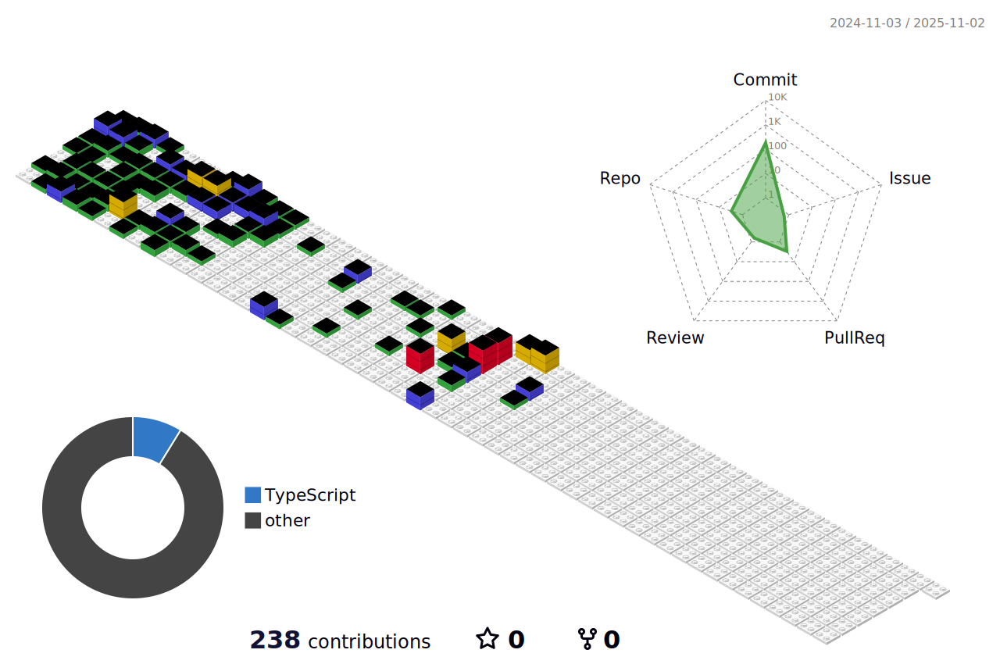

<h2 align="center">Hi there !</h2>
<!-- <h4 align="left"> 🚀 About Me </h4> -->

<h4 align="left">🛠 Languages and Tools</h4>

  

<!--
**emayom/emayom** is a ✨ _special_ ✨ repository because its `README.md` (this file) appears on your GitHub profile.

Here are some ideas to get you started:

- 🔭 I’m currently working on ...
- 🌱 I’m currently learning ...
- 👯 I’m looking to collaborate on ...
- 🤔 I’m looking for help with ...
- 💬 Ask me about ...
- 📫 How to reach me: ...
- 😄 Pronouns: ...
- ⚡ Fun fact: ...
-->

<h4 align="left">🔥 My Stats</h4>

<!--  -->

<!--
**Recent articles**
-->

  
  

